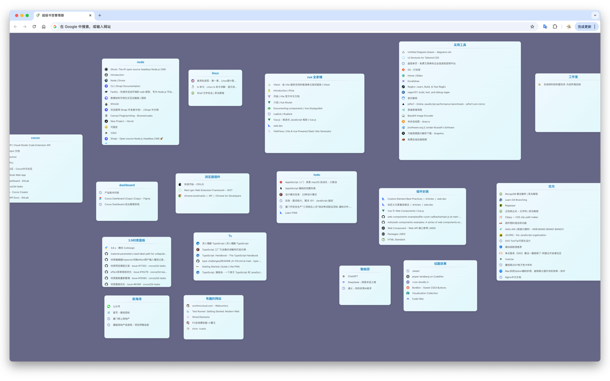

# Better-Bookmarks

    <a href="https://chromewebstore.google.com/detail/ieahkhpkiipfkiecndclbbfjfhceiknh?utm_source=item-share-cb" target="_blank">
     Chrome 
  </a>

  <a href="https://chromewebstore.google.com/detail/ieahkhpkiipfkiecndclbbfjfhceiknh?utm_source=item-share-cb" target="_blank">
     Edge 
  </a>

 
