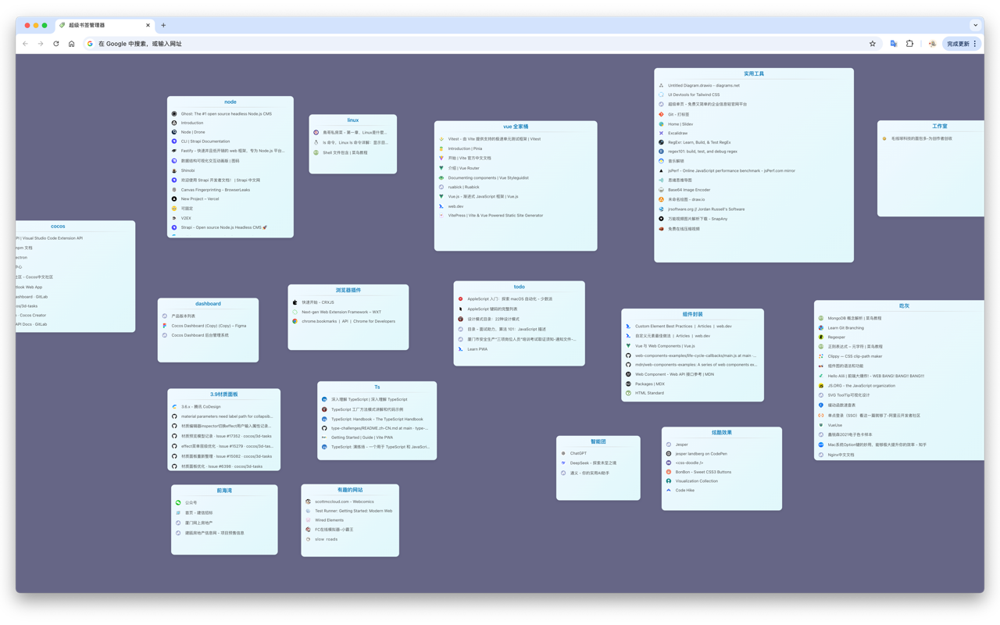

# Better-Bookmarks

    <a href="https://chromewebstore.google.com/detail/ieahkhpkiipfkiecndclbbfjfhceiknh?utm_source=item-share-cb" target="_blank">
     Chrome 
  </a>

  <a href="https://chromewebstore.google.com/detail/ieahkhpkiipfkiecndclbbfjfhceiknh?utm_source=item-share-cb" target="_blank">
     Edge 
  </a>

 

## 使用方式

点击页面右上角的 💡 图标，可以随时查看操作指南。

| 操作 | 说明 |
| --- | --- |
| 双指捏合 / Ctrl + 滚轮 | 缩放画布 |
| 双指上下左右滑动 / 滚轮 | 移动画布 |
| 左键按住空白处拖动 | 框选卡片 |
| 右键按住拖动 | 移动画布 |
| 左键拖动卡片 | 移动卡片位置 |
| 拖动卡片边缘 / 角落 | 调整卡片大小 |
| 拖拽书签到其他文件夹 | 移动书签 |
| 悬停卡片标题 | 重命名 / 删除文件夹 |
| 悬停书签 | 重命名 / 删除书签 |
